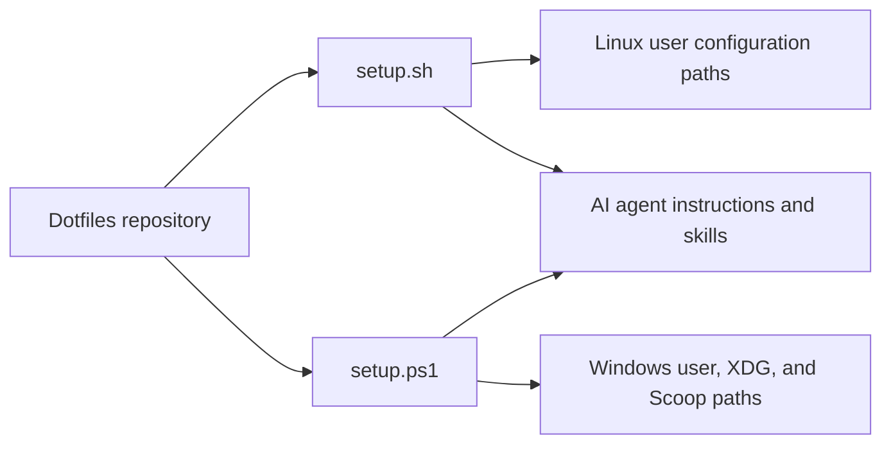

# Architecture

## Project Structure

- `.agents/` — Agent instructions and repository-managed skills for Google Antigravity and GitHub Copilot.
- `.github/` — GitHub issue and pull-request templates.
- `bash/` — Bash startup configuration.
- `docs/` — Workflow guidance, architecture decisions, and documentation index.
- `ghostty/` — Ghostty terminal configuration.
- `herdr/` — Shared and Windows-specific Herdr configurations.
- `hunk/` — Hunk configuration.
- `lazygit/` — Lazygit configuration.
- `nvim/` — Neovim setup and plugin configuration.
- `oh-my-posh/` — Prompt themes for Ghostty and Windows Terminal.
- `powershell/` — Windows PowerShell profile.
- `tmux/` — Shared tmux/psmux configuration.
- `vscode/` — Visual Studio Code settings and keybindings.
- `windows-terminal/` — Windows Terminal settings.
- `zed/` — Zed settings and keymap.

## High-Level System Diagram

## Core Components

- `setup.sh` is the Linux installer entry point. It creates symlinks from repository configurations to the user's home and application configuration paths.
- `setup.ps1` is the Windows installer entry point. It targets a named user, requires Administrator privileges plus Scoop and XDG environment variables, and creates symlinks and application-data junctions.
- The Bash and PowerShell profiles are interactive shell entry points. They load prompt and runtime tooling and expose command shortcuts.
- The terminal, editor, multiplexer, and prompt folders contain settings consumed by their respective applications; Neovim also bootstraps its plugins at startup.

## Architectural invariants

- `setup.sh` and `setup.ps1` remain the source of truth for configuration-to-target mappings; shared configuration targets stay aligned across platforms.
- Repository configuration is the live source: setup scripts create links or junctions rather than independent copies.
- Platform-specific behavior stays behind guards in shared configuration or in a platform-specific configuration file.
- The Windows Scoop AppData junctions for Zed are created before Zed settings and keymap links; the PowerShell profile launches Herdr's real Scoop binary for WMI-based daemon auto-start.
- The shared tmux configuration gates Windows-only behavior so it can serve tmux on Linux and psmux on Windows.

## Data Stores

- tmux-resurrect/psmux-resurrect, with tmux-continuum/psmux-continuum, persists multiplexer session state in user-local files. No application database, cache, or queue is configured.

## External Integrations

- **Setup runtime:** Windows setup depends on Scoop, `XDG_CONFIG_HOME`, `XDG_DATA_HOME`, `XDG_CACHE_HOME`, and the Windows registry's Shell Folders lookup. Both setup scripts call `hunk skill path` to locate the installed Hunk review skill.
- **Shell tooling:** The Bash and PowerShell profiles initialize `fnm` and Oh My Posh; Bash also loads Angular CLI (`ng`) completions. Shortcuts invoke Lazygit, Neovim, Claude (`claude`), and GitHub Copilot CLI (`copilot`).
- **Agent hosts:** Setup deploys repository instructions and skills for Google Antigravity CLI and GitHub Copilot CLI.
- **Terminal and multiplexer tooling:** The settings target Ghostty, Windows Terminal, Herdr, tmux, and psmux. Windows Terminal integrates profiles from WSL, Azure Cloud Shell, and Visual Studio. Linux tmux uses TPM with tmux-sensible, tmux-resurrect, tmux-continuum, and tmux-onedark-theme; Windows psmux uses PPM with psmux-sensible, psmux-resurrect, psmux-continuum, and psmux-theme-onedark.
- **Lazygit:** Editor actions invoke VS Code with `code --wait` and `code --goto`.
- **Neovim:** `lazy.nvim` bootstraps vscode.nvim, Comment.nvim, nvim-treesitter, nvim-lspconfig, nvim-cmp (cmp-nvim-lsp, cmp-buffer, cmp-path, cmp-cmdline, and LuaSnip), Telescope (with plenary), which-key, gitsigns, and lualine (with nvim-web-devicons). It also uses tree-sitter-cli and enables the Angular (`angularls`) and TypeScript (`ts_ls`) language servers.
- **Other editors and schemas:** VS Code settings integrate Prettier, the C# formatter, VSCodeVim, Material Icon Theme, and GitHub Copilot; Zed configures `vtsls` and the `github-copilot-cli` agent server. VS Code trusts schema sources at `aka.ms`, `developer.microsoft.com`, `json-schema.org`, `json.schemastore.org`, `raw.githubusercontent.com`, `schemastore.azurewebsites.net`, and `www.schemastore.org`; Oh My Posh themes also use the raw GitHub schema.

## Deployment & Infrastructure

The repository is installed locally per user, not built as an application. `setup.sh` maps configurations into Linux home and `.config` paths. `setup.ps1 -UserName` maps them into Windows user, XDG, Scoop-managed, and Windows Terminal paths; it runs elevated. No hosted application infrastructure is defined here.

## Security Considerations

The setup scripts replace existing target paths before linking repository content, so their mappings must remain correct. Windows installation is privileged and acts on the explicitly selected user profile; configuration flows from the repository to local user settings, with no service-facing application boundary.

## Domain language

- **Link source**: A tracked configuration file or directory that setup exposes in an application profile. _Avoid_: installed copy.
- **Link target**: A user-profile path linked to a repository source. _Avoid_: copied config.
- **Platform-specific config**: A separate file or guarded section used only on one operating system, selected by the corresponding setup script. _Avoid_: override.
